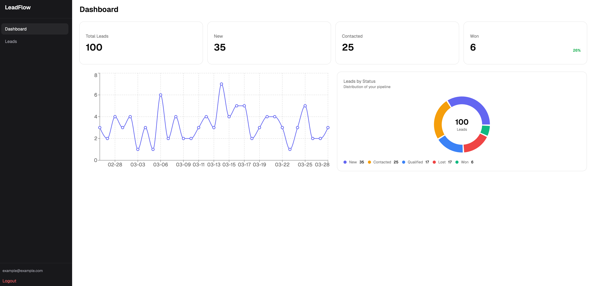
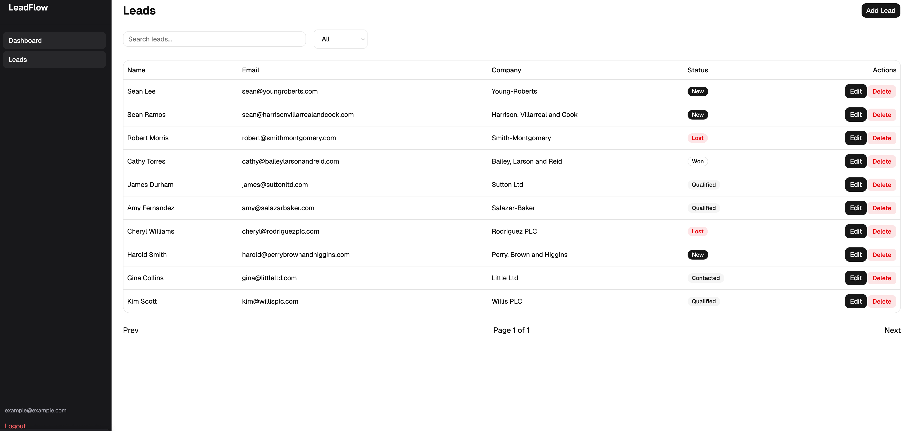
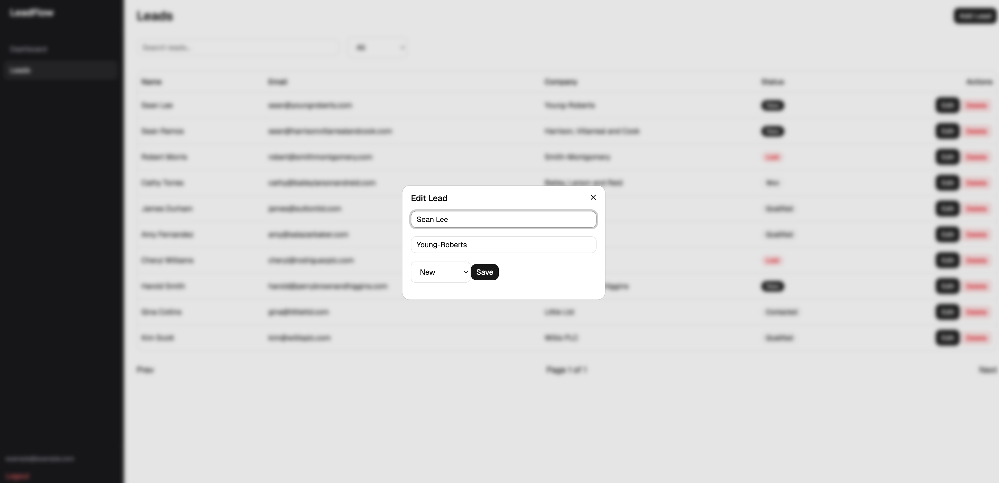

# LeadFlow CRM

🚀 **Live Demo:** https://leadcrm.kodario.com/

LeadFlow is a modern full-stack CRM application for managing leads, built with React, Next.js, FastAPI, and Docker.  
It is designed to be scalable, clean, and production-ready with HTTPS support via reverse proxy.

---

## 📸 Screenshots





---

## 🚀 Features

- Lead management (CRUD)
- Analytics dashboard
- Authentication (JWT-based)
- REST API with FastAPI
- Modern UI with React / Next.js
- Dockerized environment
- Reverse proxy with Caddy (HTTPS ready)

---

## 🏗️ Tech Stack

### Frontend

- React
- Next.js
- Axios

### Backend

- FastAPI
- Uvicorn

### Infrastructure

- Docker & Docker Compose
- Caddy (reverse proxy)

---

## 📦 Project Structure

```
.
├── frontend/        # Next.js app
├── backend/         # FastAPI app
├── docker-compose.yml
├── Caddyfile
└── docs/            # screenshots
```

---

## ⚙️ Setup

### 1. Clone repository

```bash
git clone https://github.com/your-username/leadflow-crm.git
cd leadflow-crm
```

---

### 2. Run with Docker

```bash
docker compose up --build
```

---

### 3. Access app

- Frontend: https://leadcrm.kodario.com/
- API: https://leadcrm.kodario.com/api

---

## 🔧 Configuration

### Environment Variables (Frontend)

```
NEXT_PUBLIC_API_URL=/api
```

---

## 🧠 Important Notes

### Reverse Proxy (Caddy)

All API requests are proxied:

```
/api/* → backend
/* → frontend
```

---

### FastAPI Proxy Fix

To properly handle HTTPS behind a reverse proxy:

```bash
uvicorn app.main:app --proxy-headers --forwarded-allow-ips="*"
```

---

### Trailing Slash Issue

FastAPI distinguishes between:

```
/api/leads
/api/leads/
```

Recommended fix:

```python
app = FastAPI(redirect_slashes=False)
```

---

## 🐛 Common Issues

### Mixed Content Error

Cause:

- Backend returning `http://` URLs

Fix:

- Use `--proxy-headers` in Uvicorn
- Set `X-Forwarded-Proto` in Caddy

---

### 404 on API Endpoints

Cause:

- Trailing slash mismatch

Fix:

- Ensure consistent endpoint usage or disable redirect_slashes

---

## 📄 License

MIT License

---

## 👨‍💻 Author

Adrian Domański  
Full-Stack Developer
